# UX - Research  

* **Track:** _Especialización UX Designer_
* **Curso:** _Primer proyecto de UX_
* **Unidad:** _Pimer proyecto UX_
* **Alumnas:**  
  * Alexandra Calderón.
  * Ruth Matos
  * Rocio Quilla.
  * María Teresa Ruiz.  
  * Angelica Maria Villalobos.
  * Claudia Ingrid Zarate.

***

## RETO

**Nueva experiencia en empresas de buses**

Nos ha contactado Catalina una emprendedora viajera con una idea de negocio. Durante sus últimas vacaciones Catalina estuvo viajando por todo latinoamérica. Durante estos viajes Catalina tuvo que tomar muchos buses de todo tipo para llegar a ver los paisajes más lindos del continente. Durante sus viajes Catalina se dio cuenta que existen aún muchas oportunidades para mejorar la experiencia de todos los usuarios de este tipo de transporte: horarios, embarques, desembarques, compra de tickets en los terminales, compra de tickets online, cancelaciones, cambios de pasajes, etc. Adicionalmente, Catalina se dio cuenta que todas las plataformas de venta de tickets de bus tienen cosas por mejorar en Chile, Perú y México.

Luego de vivir todo esto, Catalina está pensando en emprender en este sector. Para ello ha contratado a tu squad para que la ayude a investigar más sobre los usuarios de este tipo de transportes y para que definan y prueben un MVP.

Con tu asesoría, ella podrá sustentar su idea de negocio a un grupo de inversión y así obtener el financiamiento necesario para emprender su negocio y mejorar la experiencia en este rubro.

## **Flujo de trabajo:**

### Research

En esta sección empezamos a entender los problemas del usuario. Es por eso que salimos a hacerles una breve encuesta para saber más de ellos y, así mismo, realizamos una encuesta online con las mismas preguntas que hemos utilizado en la encuesta presencial.

![Imagen 1][1]  ![Imagen 2][2]  ![Imagen 3][3]  ![Imagen 4][4]  ![Imagen 5][5]

 [1]: assets/img/form1.PNG
 [2]: assets/img/form2.PNG
 [3]: assets/img/form3.PNG
 [4]: assets/img/form4.PNG
 [5]: assets/img/form5.PNG

 A continuación se muestra la página, donde se encontrarán fotos de las encuestas para al realización del proyecto, y los insights obtenidos de las encuestas:

  [LINK](https://mariaruizq.github.io/wanderBus-prototype/).

Algunos insight que obtuvimos de las encuestas virtuales son:

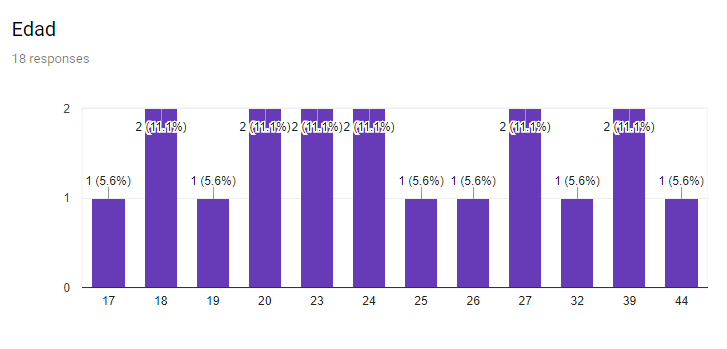
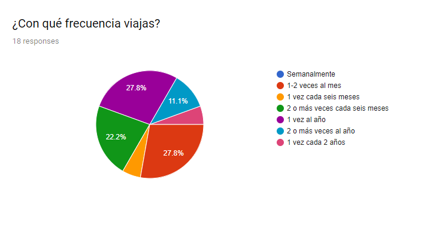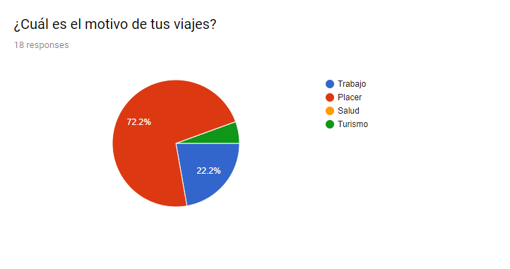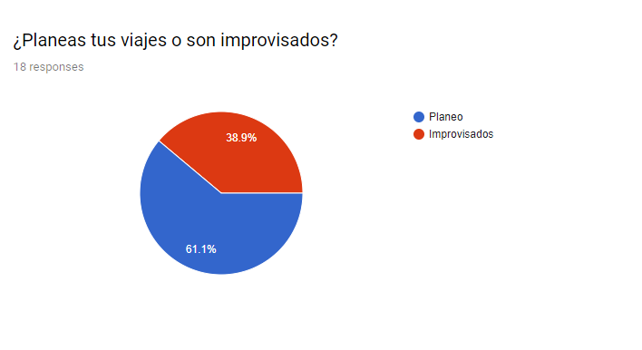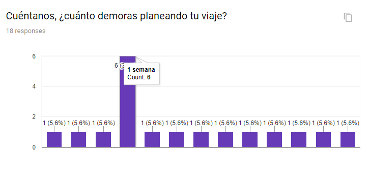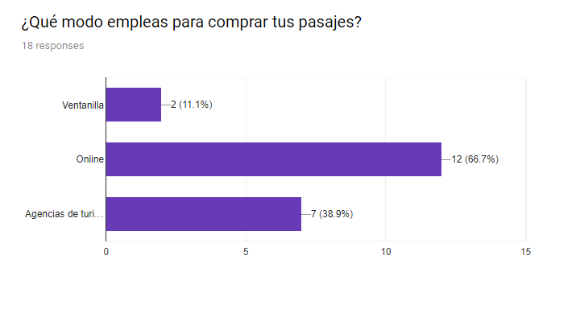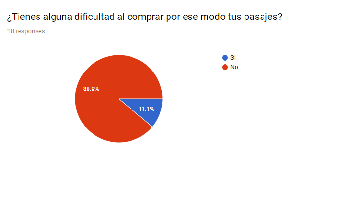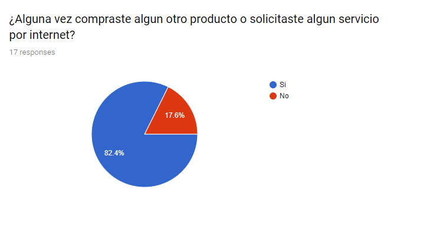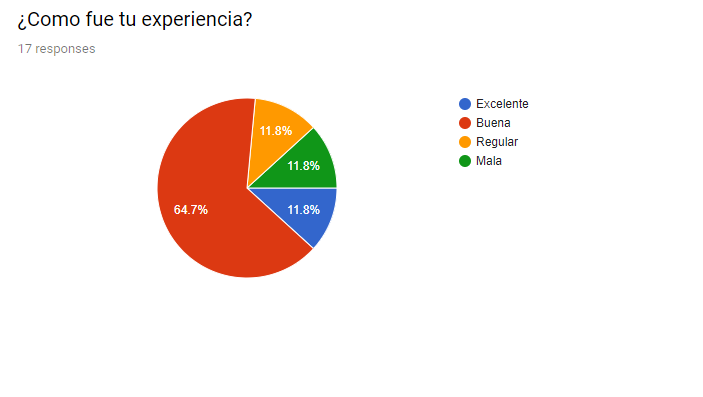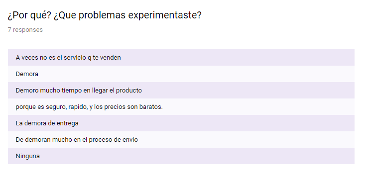

### Síntesis

Mediante la técnica del Affinity Mapping podemos procesar de mejor manera los insights hallados en el research y pudimos llegar a encontrar los problemas.

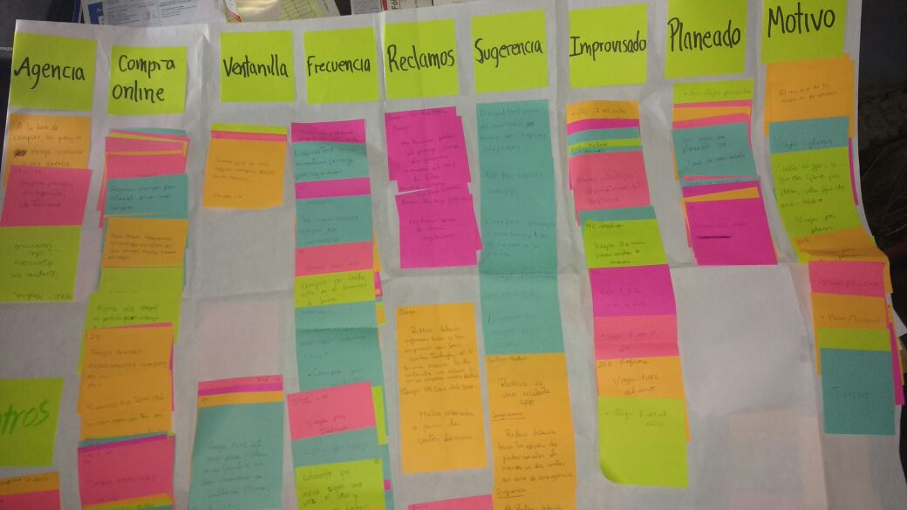
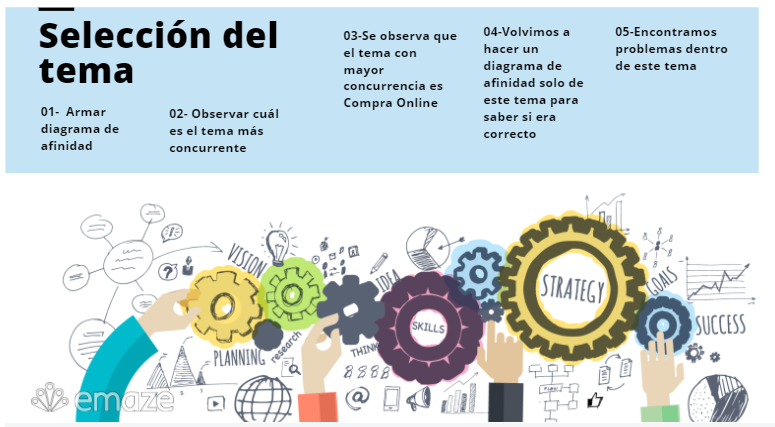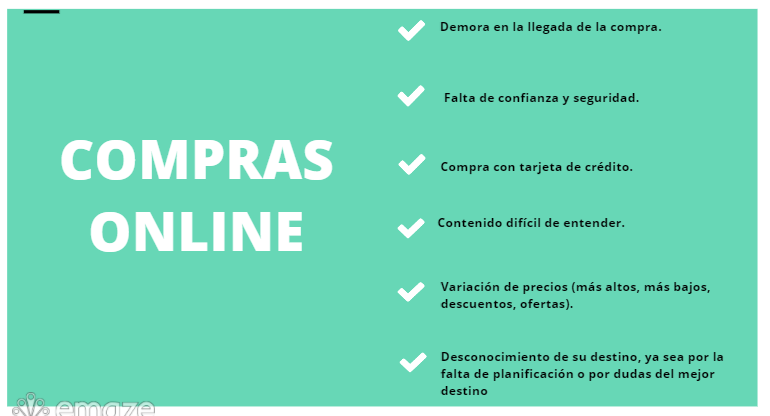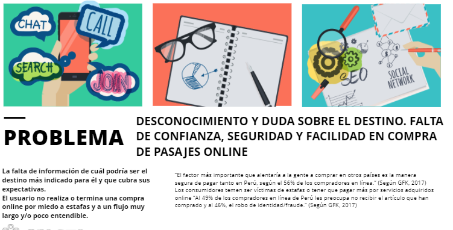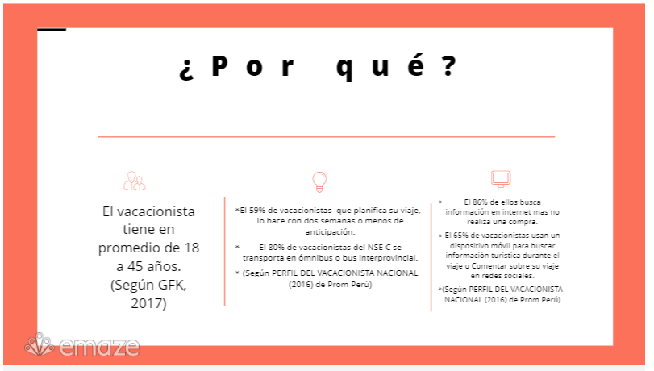

#### User Personas

Después de definir el problema creamos un arquetipo sobre nuestro ususario con todos los datos recogidos.

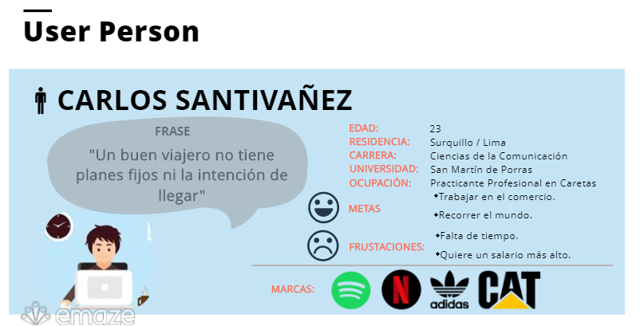

### Served Persona

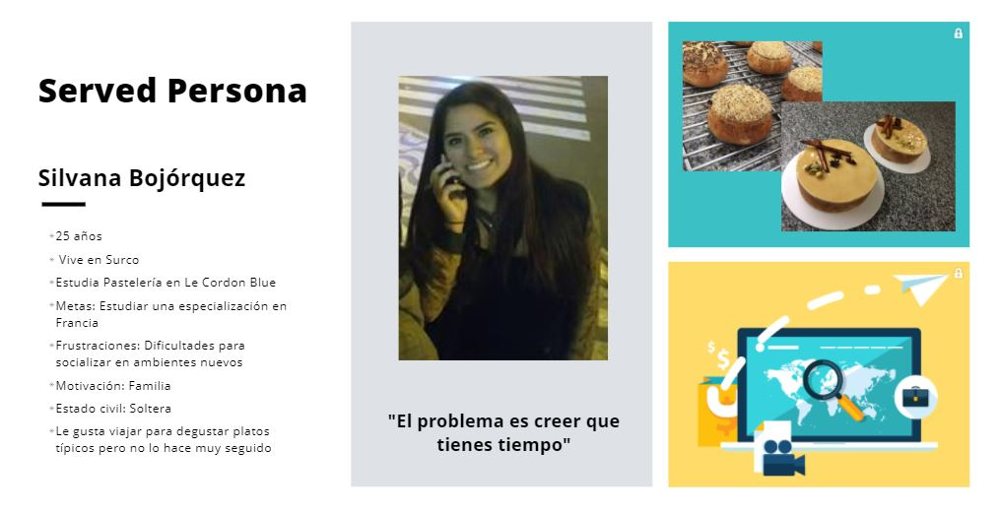

### Negative Person

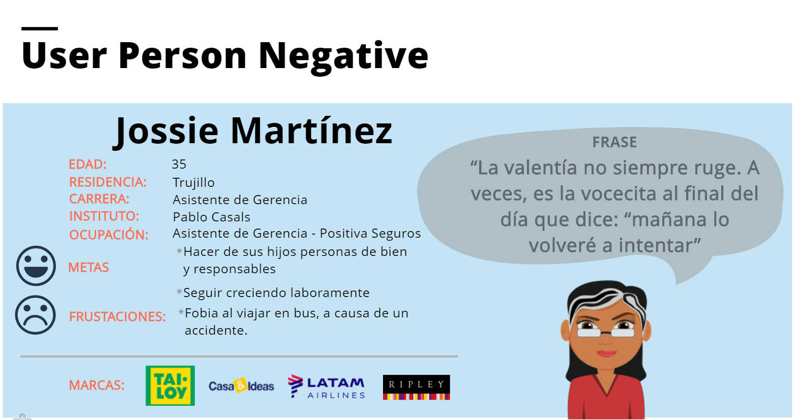

#### Problem statements & How might we? & what if...?
-  Carlos NECESITA una manera segura PARA comprar pasajes online.
-  Carlos QUISIERA que el proceso de compra PARA realizar compras online.

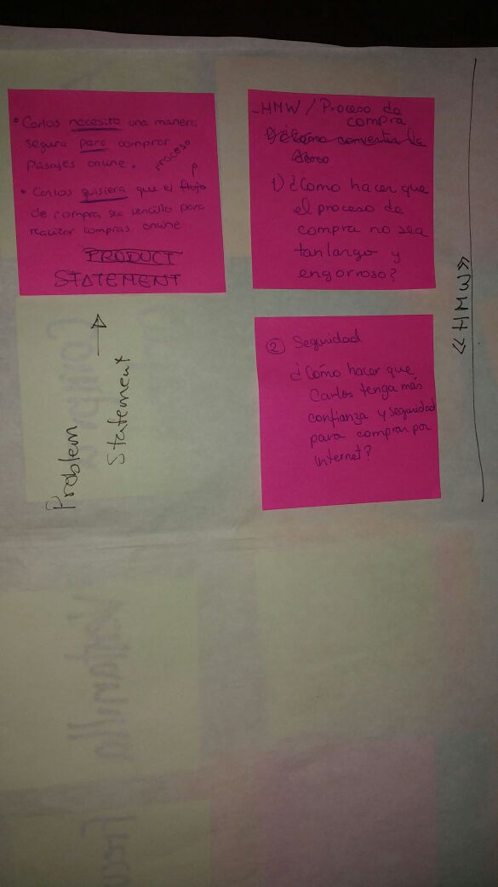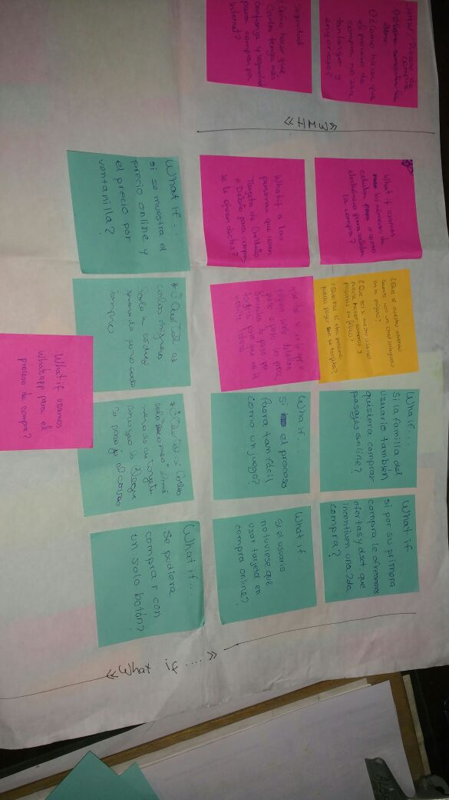

### Conceptualización

Es aquí donde empezamos a pensar en qué funcionalidad debería tener nuestro MPV.

Aquí algunas ideas.

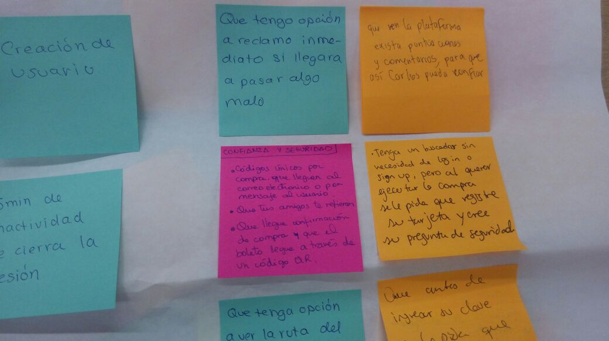

**Benchmarking**
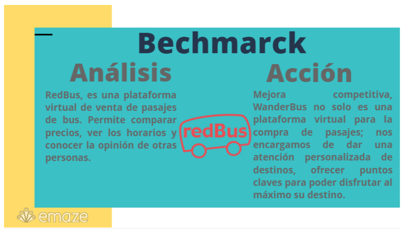

**Brainstorm**

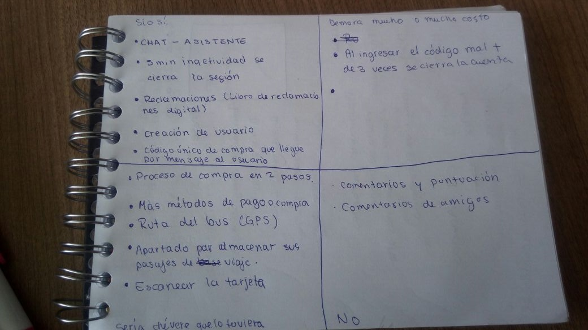

Es así que se crea el story board para este user person

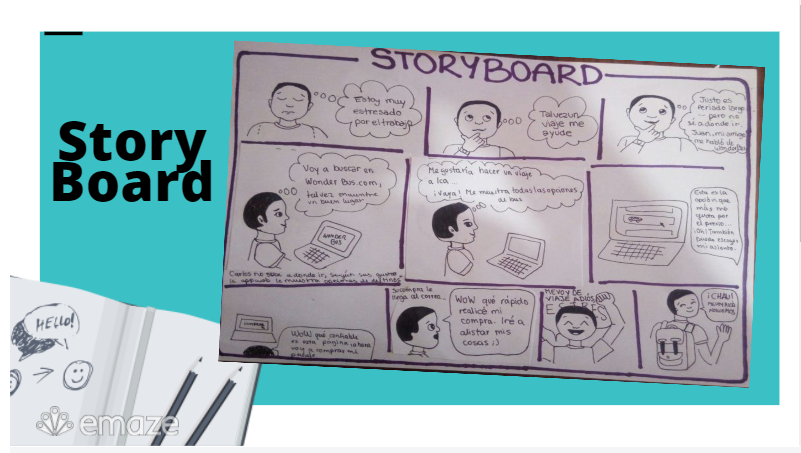

**Guión Literario**

Carlos se siente estresado debido a su ajetreado horario laboral, es por ello, que aprovechará los días de feriado largo para hacer un viaje y disfrutar de lo que mas le gusta hacer.

El día de partida está cerca y el aun no hizo ningún plan, pero recuerda que su amigo que su amigo Roberto le comentó que wanderbus.com le ayudó a planificar su viaje de forma rápida y segura.

Carlos decide ingresar a wanderbus.com y encuentra un portal dinámico y muy fácil de usar, que le sugiere destinos de acuerdo a las actividades que le gusta hacer cuando viaja.

Y al cabo de 10 minutos, ya tiene la compra del ticket realizada, lo que le da tranquilidad y tiempo suficiente para hacer sus maletas y partir.

Carlos se encuentra muy feliz en Ica haciendo tubulares, pasando unas vacaciones increíbles.

**Content Prototyping**

**WanderBus**

“Viaja fácil y seguro”

¡Hola, bienvenido a WanderBus. Para brindarte una experiencia única de viaje. Elige la opción que prefieras!

1. Quiero explorar nuevas opciones.
2. Ya tengo elegido mi destino.

(​Elige: ‘Opción 1 ​ )

Queremos conocerte más! Elige lo que más te gusta hacer cuando viajas!

*Aparecerán imágenes de … y se puede elegir mas de una opción.

* Deportes extremos, soy un adrenalina lover!
* Festivales de música
* Festividades tradicionales
* Visitar sitios arqueológicos
* Naturaleza
* Playas
* Imperdibles

(Elige deportes de aventura y naturaleza)

*Aparecerán imágenes con los destinos

* Lunahuaná
* Ica
* Cusco
* Amazonas
* Tarapoto
* Tingo María

*Aparecerá a modo de banners; ofertas, promociones, información relacionada a los destinos elegidos.

(Selecciona Ica)

Se muestra una pequeña infografía con información resumida de la provincia, actividades que realizar (deportes extremos), lugares turísticos para disfrutar de la naturaleza, comidas típicas,  con opción a Ver más.

**Ica:**
A solo unas horas de Lima se encuentra la mezcla perfecta de aventura y relax. Ica es más que solo un buen pisco: disfruta de sus playas, valles y del increíble oasis de la Huacachina todo el año y atrévete a realizar sandboard sobre las dunas o recorre los inmensos desiertos en un tubular. No esperes más y descubre todo lo que esta región tiene para ofrecerte.

**Aventurate a hacer estos  deportes extremos! :**

*(*Por cada opción, se muestra el costo, puntuación, agencias con las que puede hacerlo y cuales son los requerimientos y previsiones a tener en cuenta.)*

* Paseos en carros tubulares en La Huacachina
* Sand-boarding en La Huacachina
* Vuelo en Parapente en Paracas
* Trekking en la bahía de Paracas
* Biking en Paracas
* Canotaje
* Windsurf en las playas de Paracas
* Kayak en la bahía de Paracas
* Quads en Paracas
* Buceo en Paracas

**Atractivos turísticos en la naturaleza que tienes que visitar!**

*(*Cada opción se presenta con fotografías del lugar, un mapa, indicaciones de como llegar ahi desde la ciudad y una puntuación)*

* Acueducto de Cantalloc
* Cerro Blanco
* Islas Ballestas
* Reserva Nacional de Paracas
* Reserva Nacional de San Fernando

**Lista de Restaurantes** ( con opción a filtrarlos de acuerdo al precio y el tipo de comida que ofrecen)
**Lista de Hospedajes** ( con opcion a filtrarlos de acuerdo al precio y los servicios que ofrece)

Aparece un botón que dice “Reserva ahora”

Un modal con las fechas de viaje para que pueda seleccionar (Ida y regreso)

* Fecha: (Selecciona en un calendario)

Viajaremos, viajaremos y el mundo conquistaremos <3

* (Lista de opciones de los pasajes: precio, empresa, horario)
(​Selecciona: ‘Una opción’ ​ )
* Información del boleto
--------
(​Elige: ‘¡Comprar!’ )

¿Es tu primera vez con nosotros? Por favor, regístrate para brindarte la mejor seguridad al ejecutar la compra

* Facebook

* Gmail

* Correo

Alert: *Al registrarte recibirás un cupón con el 30% de descuento para que lo uses en tu primer viaje con nosotros!

¡Estás más cerca de iniciar una nueva aventura!

* Tarjeta de crédito/débito

* Pago Efectivo

(​Elige: ‘tarjeta’ ​)

* Crédito

* Débito

(​Elige: ‘Débito’ ​)

* Ingresa los datos del medio de pago.

* Ingresa tu número de celular para enviarte un código de seguridad.

¡Ya estamos a solo un paso! Te acabamos de enviar un código de seguridad a tu celular.

* Ingresa tu código de seguridad para seguir con la compra
(​Ingresa: ‘código de compra’ ​)

¡Yay! La compra ha sido exitosa.  Te estamos enviando los pasajes al correo con el que te registraste. En la sección “Mis Viajes” encontraras tu pasaje digital para que lo descargues o compartas en tus redes.

¡Listo! Ahora solo falta hacer las maletas.
La familia de Wanderbus te desea un feliz viaje!

(Elige “Pago Efectivo”)

*(*Aparecerá un modal con el codigo de Pago Efectivo y los bancos donde puede acercarse a pagar de modo presencial si lo prefiere o hacer una transferencia mediante Banca por Internet)*

**Segunda Opción:**

¡Hola, bienvenido a WanderBus. Para brindarte una experiencia única de viaje. Elige la opción que prefieras!

1. Quiero explorar nuevas opciones.
2. Ya tengo elegido mi destino.

(​Elige: ‘Opción 2’ ​ )

¡Perfecto! ¿A dónde quieres ir?
* Origen: …
* Destino: ...
* Fecha: ...
(​Escribe: ‘Lima - Ica’ ​ )  

Estas son las mejores opciones para ti !

* (Lista de opciones de los pasajes: precio, empresa, horario)
(​Selecciona: ‘Una opción’ ​ )
* Información del boleto
--------
(​Elige: ‘¡Comprar!’ )

¿Es tu primera vez con nosotros? Por favor, regístrate para brindarte la mejor seguridad al ejecutar la compra
* Facebook
* Gmail
* Correo

Alert: *Al registrarte recibirás un cupón con el 30% de descuento para que lo uses en tu primer viaje con nosotros!

¡Estás más cerca de iniciar una nueva aventura!

* Tarjeta de crédito/débito
* Pago Efectivo

(​Elige: ‘tarjeta’ ​ )

* Crédito
* Débito

(​Elige: ‘Debito’ ​)

* Ingresa los datos del medio de pago.
* Ingresa tu número de celular para enviarte un código de seguridad.

¡Ya estamos a solo un paso! Te acabamos de enviar un código de seguridad a tu celular.

* Ingresa tu código de seguridad para seguir con la compra.
(​Ingresa: ‘código de compra’ ​ )

¡Yay! La compra ha sido exitosa.  Te estamos enviando los pasajes al correo con el que te registraste. En la sección “Mis Viajes” encontraras tu pasaje digital para que lo descargues o compartas en tus redes.

¡Listo! Ahora solo falta hacer las maletas.

La familia de Wanderbus te desea un feliz viaje!

(Elige “Pago Efectivo”)

(*Aparecerá un modal con el codigo de Pago Efectivo y los bancos donde puede acercarse a pagar de modo presencial si lo prefiere o hacer una transferencia mediante Banca por Internet)

**Log In / Usuario**

* Sección “Mis Viajes”
Puede ver los tickets de sus viajes.

* Sección “Promociones”
Puede ver descuentos y promociones de la temporada.

* Sección “Recomienda”
Puede mandar invitaciones a sus amigos y ganar descuentos.

## Resumen

Nuestro usuario principal se llama Carlos, vive en lima y tiene 24 años. Él es comunicador social y trabaja en El Comercio. Viaja dos veces por año. Generalmente una vez en sus vacaciones y otra en feriado largo con amigos.  En su tiempo libre le gusta practicar deportes y salir a divertirse con sus amigos los fines de semana.
Carlos ha realizado algunas compras online, pero sus experiencias no han sido las mejores. Por eso cuando viaja prefiere comprar en ventanillas o agencias, pero eso le demanda mucho tiempo. Por ello, esta considerando otras opciones que le resulten más rápidas y sencillas.

## Logotipo 

Elegimos el nombre de Wanderbus, ya que *wander* en inglés, significa recorrer, pasear, etc y le añadimos Bus por el rubro de venta de pasaje de bus.

## Prototipo

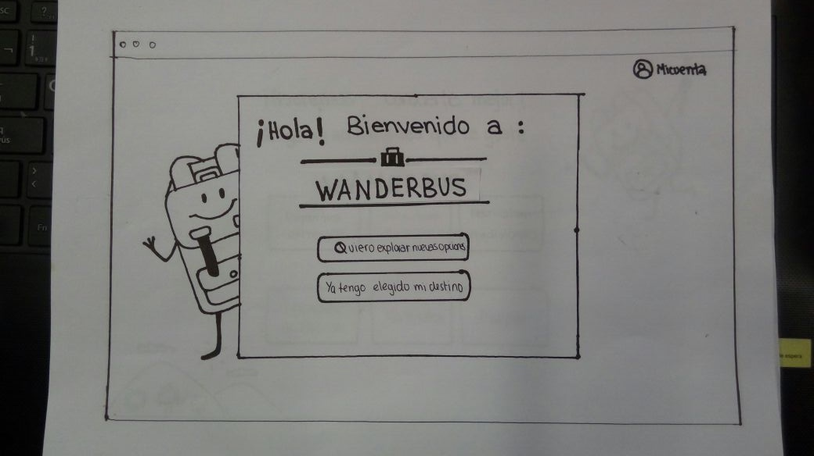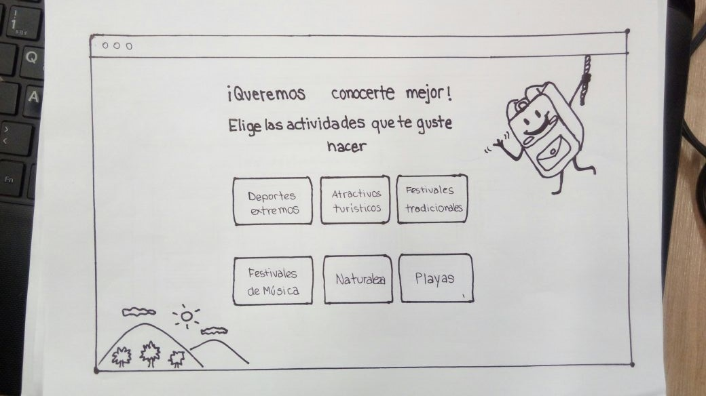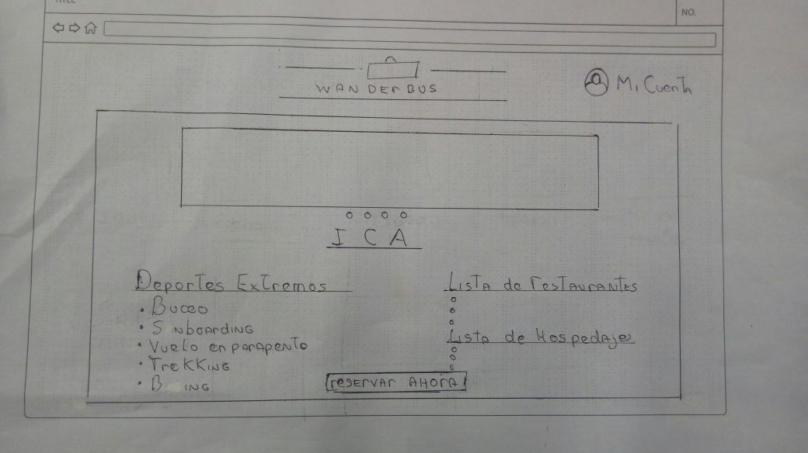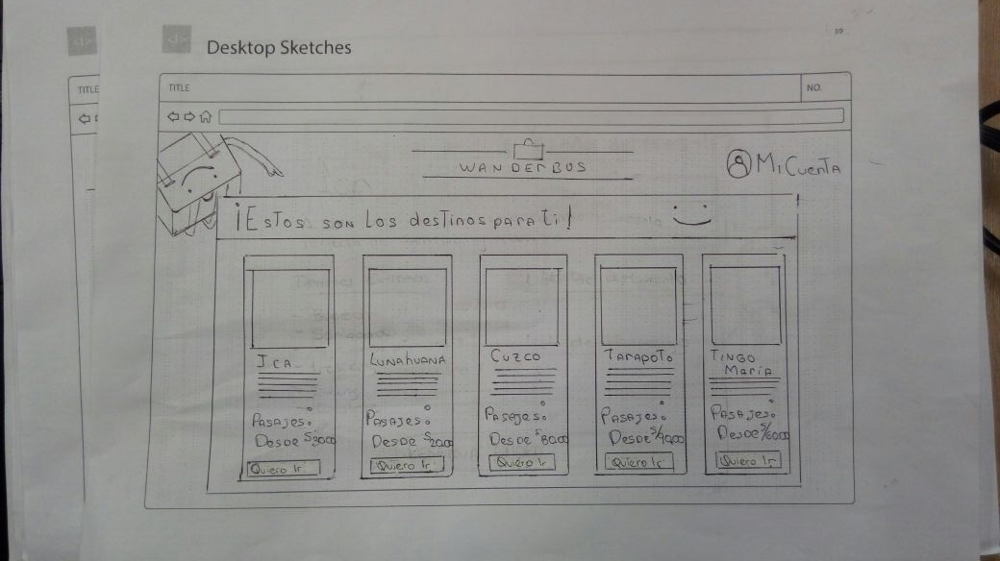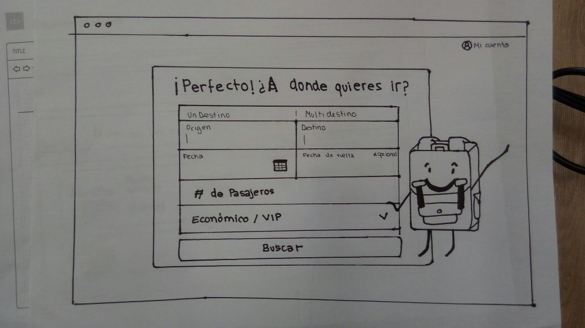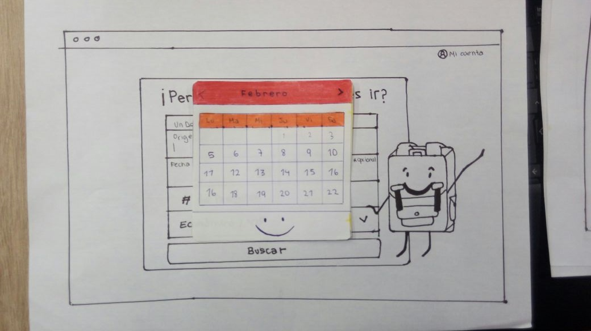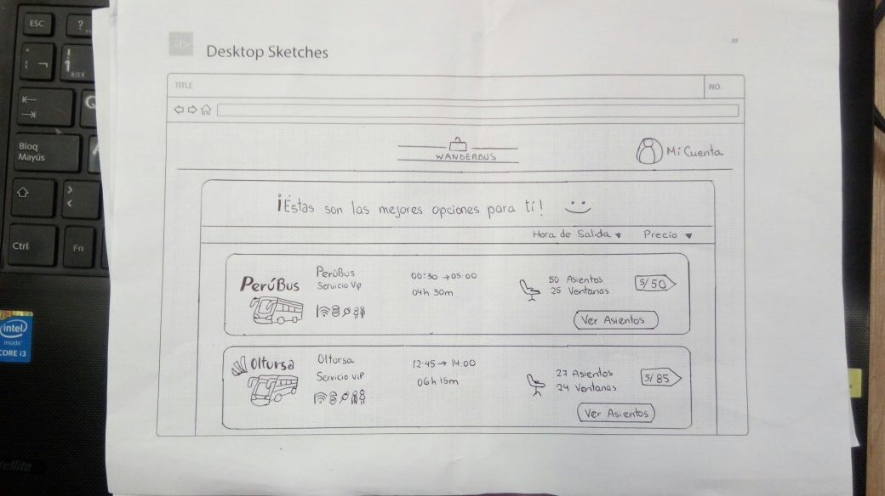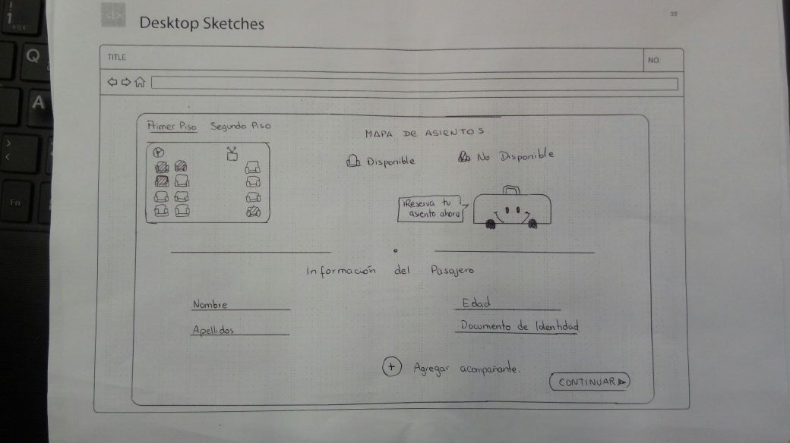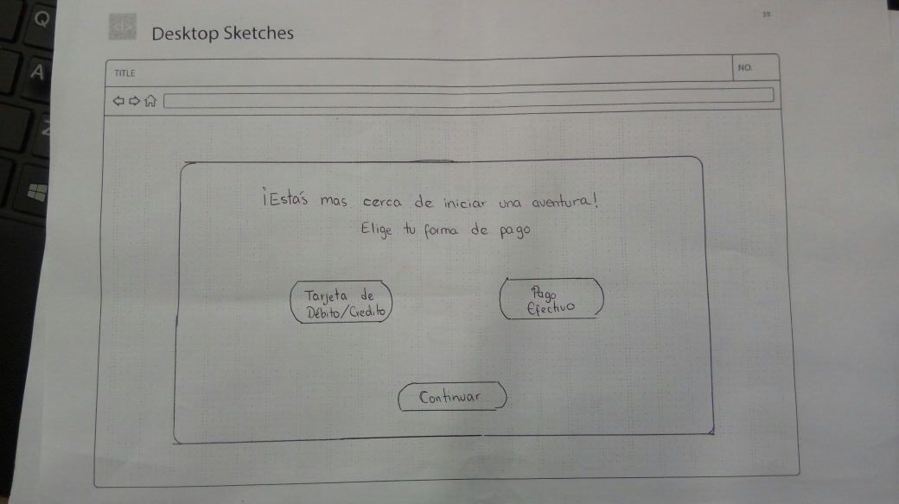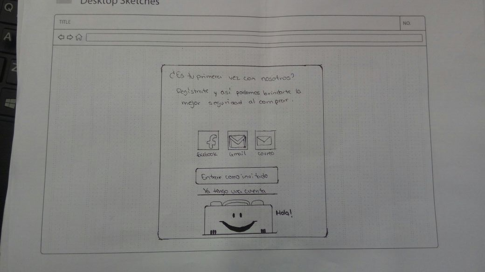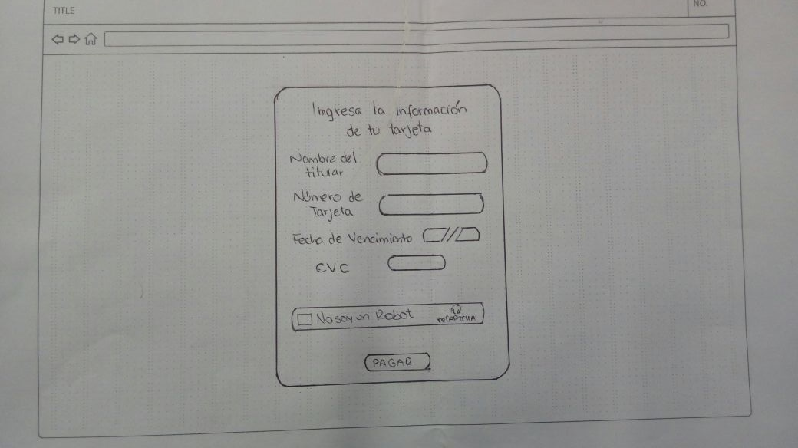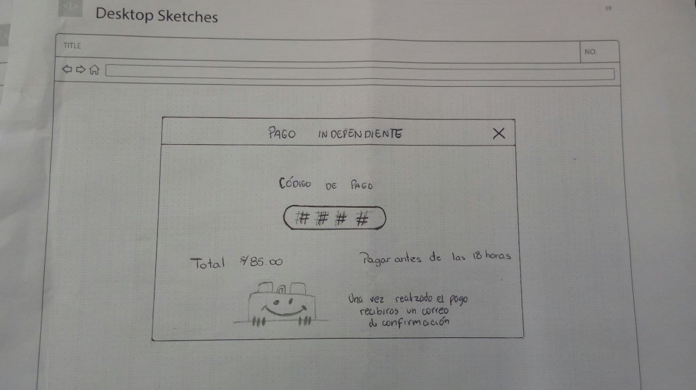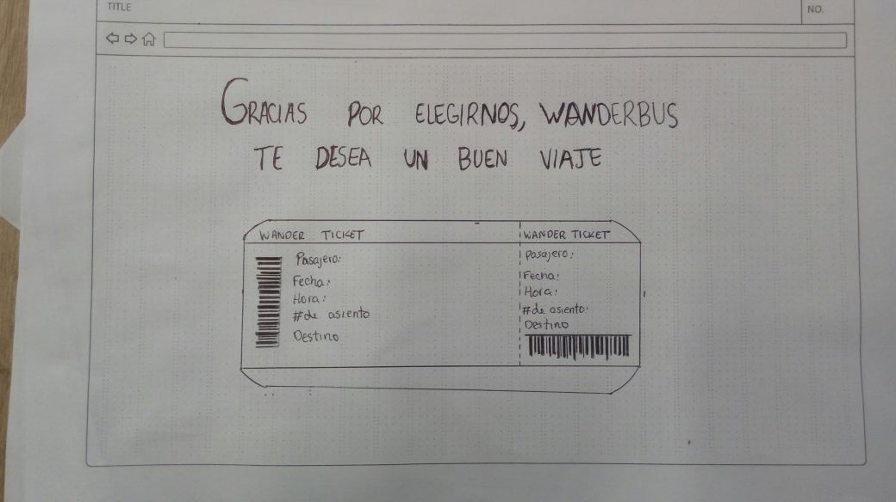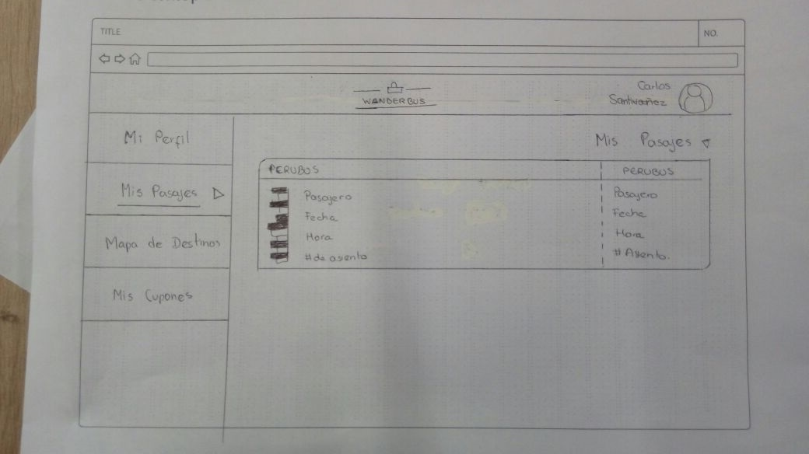

Para una mejor visualizacion de nuestro prototipo, le sugerimos dar click al siguiente link donde se encontrará un carrusel, con las vistas, en orden, del prototype

[LINK](https://mariaruizq.github.io/wanderBus-prototype/).

## Primer Testing

**Fecha:** *6 de febrero*
**Usuario:** *Diego*

En resumen, Diego nos comentó que si bien el proceso era entendible, le parecía muy largo y su sugerencia fue unir algunas vistas para acortar el proceso. Tambien nos recomendó que le gustaria observar que los precios de los pasajes se puedan ver desde el inicio (al momento de ofrecer los destinos) para poder ceñirse a un presupuesto.

**Usuario:** *Ruth*

Ruth nos mencionó que no le parecía seguro que solo le enviaran un mensaje con un codigo, porque al final si pondria un numero de teléfono no hay forma de saber si esta vinculado con la tarjeta es por eso que  sugirió un codigo CAPTCHA y que le parecía muy amigable y divertido nuestro *helper*. 

## Segundo Testing

**Fecha:** *7 de febrero*
**Usuario:** *Lourdes Vilchez*

Con el primer prototipo mejorado, recibimos un nuevo feedback y los puntos a mejorar que se observaron fueron:

Esta vez, Lourdes hizo hincapié en la seguridad que queremos trasmitir con nuestro website. Nos hizo dar cuenta que necesitabamos una identificacion de seguridad adicional, es decir, contar con un sello de seguridad en el modal que pedimos los datos de la tarjeta de crédito o débito para realizar la transacción si no perdemos confiabilidad.

Y que en la ventana de registro ya no seria necesario que usemos Facebook o Gmail para el registro ya que nuevamente ponemos en riesgo la seguridad del portal.

Así mismo, que detallemos mejor el modal con la opción de Pago Efectivo, que se especifique principalmente como es que podemos utilizar esta modalidad y en que lugares podemos pagarla.

Por otro lado, como aspectos positivos de nuestro website, fueron que le gusto que existan opciones de las actividades a realizar en el destino escogido ya que es muy importante para ella saber que más hacer en un lugar que apenas conoce y que el proceso le pareció fácil e intuitivo.

## Storytelling

Carlos es un chico súper alegre, a pesar de todo siempre ha sabido ser positivo. Se esforzó mucho por conseguir terminar su carrera, es un comunicador de 24 años, exitoso. 
Cuando comenzó a trabajar le iba súper, y así fue ascendiendo, y su tiempo disminuyendo. Por esto, comenzó a dejar pasiones de lado, como conocer nuevos lugares y personas. Lo que lo llevó a estar cansado de su rutina, casi casi se convierte en un pesimista. Sin embargo, hoy en la mañana, al despertarse dijo: "NO, no puedo perderme a mí mismo" y con todas las ganas, está dispuesto a retomar y equilibrar su vida entre sus pasiones y su trabajo.

Para su suerte, hay un feriado largo a puertas, y piensa viajar dentro del Perú. Sin embargo, sabe que no puede dejar la responsabilidad del trabajo atrás y sentarse a buscar por internet lugares nuevos y maravillosos.

Entonces, recuerda que un compañero le recomendó una página: WANDERBUS. Entra y la página, se ve prometedora, le han dado a elegir ciertos criterios para darle como resultado "el sitio ideal para viajar". Y "Oh, vaya!" según la página, su lugar ideal sería Ica e incluso puede comprar el boleto de bus ahí mismo, escoger su asiento y pagar con tarjeta de crédito en menos de 5 minutos

Relajado Carlos, vuelve a su rutina, más feliz, más contento pero sabiendo que le espera un gran viaje.. 

## Customer Journey Map

### Sin Web

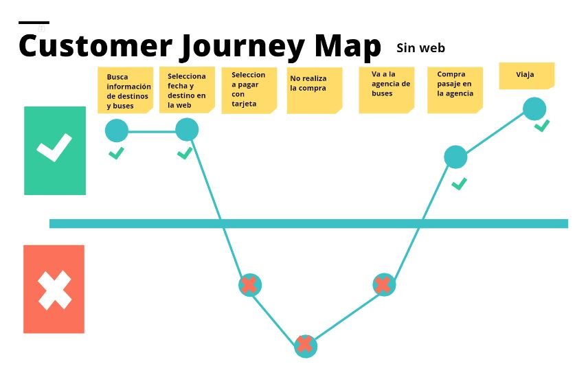

### Con Web

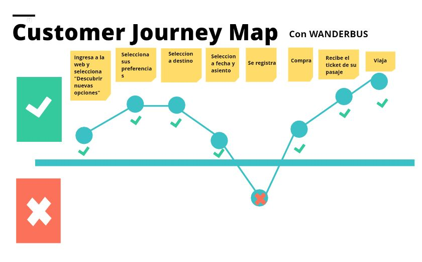

